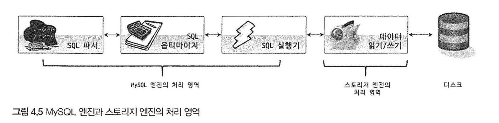
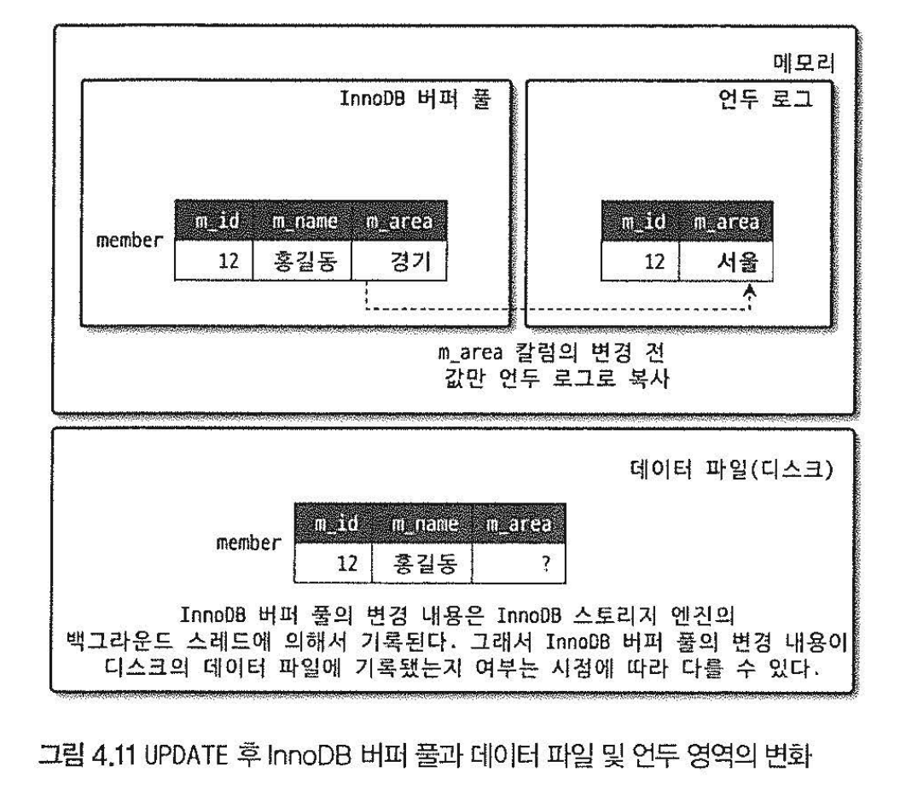
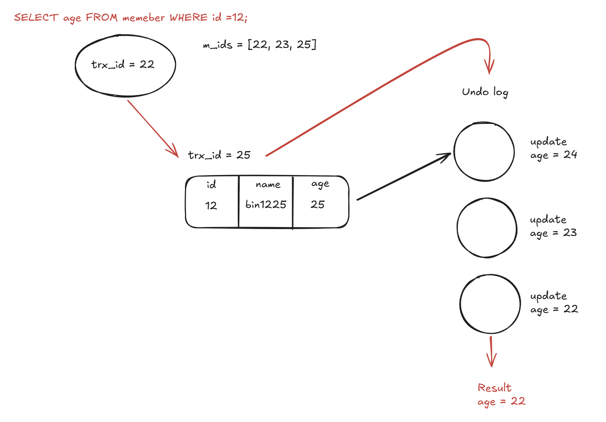

# MySQL InnoDB MVCC의 작동 원리

## Mysql 의 쿼리 실행 구조

Mysql에서 쿼리가 실행되는 과정을 분해해보면 다음과 같다.

SQL 파서 -> SQL 옵티마이저 -> SQL 실행 -> 데이터 읽기/쓰기

여기서 데이터 읽기/쓰기가 실제 디스크에 접근하여 데이터를 읽고 쓰는 작업을 수행한다.

이 부분이 스토리지 엔진이 처리하는 영역이다.

MYSQL의 특징 중 하나는 이 스토리지 엔진을 플러그인 해서 사용할 수 있다는 것이다.

그 중 가장 많이 사용되는 것이 InnoDB 스토리지 엔진이다.

### InnoDB 스토리지 엔진 아키텍처

InnoDB 는 MySQL 스토리지 엔진 중 거의 유일하게 레코드 기반 잠금을 제공한다.

## 트랜잭션이 동시에 실행될 때 발생할 수 있는 문제점

트랜잭션은 작업의 원자성을 보장한다. 
반면 여러개의 트랜잭션이 동시에 실행되기 때문에 발생할 수 있는 문제점들이 있다.

### Dirty read
트랜잭션이 commit 되지 않은 트랜잭션에 의한 데이터를 읽는다.

> ex) A 트랜잭션이 B트랜잭션이 추가한 rowB를 읽음 -> B 트랜잭션 rollback 

### Nonrepeatable read
한 트랜잭션 내에서 같은 쿼리를 두번 실행했을 때, 수정에 의해 결과가 다른 경우

> A트랜잭션이 실행되는 도중에 트랜잭션 B가 A가 조회하는 데이터를 수정하는 경우

### Phantom read
한 트랜잭션 내에서 특정 범위에 대해 두번 조회했을 때, 추가에 의해 결과가 다른 경우

> A트랜잭션이 나이가 40 이상인 사용자를 조회
 B트랜잭션이 나이가 40 이상인 사용자를 중간에 추가

### Serialization Anomaly(직렬화 이상)
commit 결과가 트랜잭션들을 어떤 순서로 배치해도 불가능한 값인 경우

비즈니스 규칙: "우리 은행 계좌 A와 B의 잔액 합계는 항상 0원 이상이어야 한다."

현재 상태: 계좌 A(100원), 계좌 B(100원) / 합계 200원
트랜잭션 1: 계좌 A에서 150원 출금 시도. (A+B = 50원이므로 규칙 준수, 실행)

트랜잭션 2: 계좌 B에서 150원 출금 시도. (A+B = 50원이므로 규칙 준수, 실행)

결과: 계좌 A(-50원), 계좌 B(-50원) / 합계 -100원 (규칙 위반)

---
### Lock

이러한 동시성 문제를 해결하기 위해 기본적으로 locking protocol을 사용한다.

- shared lock
- exclusive lock

락을 사용하면 동시성 문제를 해결할 수 있지만, 다른 트랜잭션의 작업을 대기해야하기 때문에 병목이 발생한다.

이러한 영향을 최소화 하기 위한 방법 중 하나가 MVCC 이다.

## MVCC (Multi Version Concurrency Control)

MVCC 의 핵심 철학은 데이터의 버전을 여러개로 유지하는 것이다. 

여러개의 버전을 유지하고, 각 트랜잭션은 자신이 읽을 수 있는 버전 데이터를 조회한다.

InnoDB에서 트랜잭션은 격리 수준에 따라 특정 시점에 Read View 를 만든다.

- REPEATABLE READ: 트랜잭션 내 첫 번째 SELECT 실행 시 생성 후 트랜잭션 종료까지 유지.

- READ COMMITTED: 매 SELECT 쿼리 실행 시마다 새로 생성.

ReadView에는 다음과 같은 정보가 생성된다.
- `creator_trx_id`: 해당 Read View를 생성한 트랜잭션 자신의 ID
- `m_ids` : Read View가 생성되는 시점에 현재 실행 중인(아직 커밋되지 않은) 활성 트랜잭션 ID 목록
- `min_trx_id`: 목록 중 가장 id가 작은 값
- `max_trx_id`: Read View 생성 시점까지 할당된 가장 큰 트랜잭션 ID보다 1이 큰 값

각 트랜잭션은 수정 시 해당 row 에 자신의 **DB_TRX_ID**와 **DB_ROLL_PTR(롤백 포인터)** 를 기록한다.

이후 다른 트랜잭션에서 해당 row 접근 시 id 값을 확인하고 ReadView를 기준으로 읽기 가능 여부를 결정한다.

기록된 트랜잭션 ID를 `trx_id` 라고 할 때,
1. `trx_id` < `min_trx_id` 

이미 커밋된 트랜잭션을 의미하므로 조회 가능

2. `trx_id` >= `max_trx_id` 

ReadView 생성 이후에 실행된 트랜잭션이므로 조회 불가

3. `min_trx_id` <= `trx_id` < `max__trx_id`

`trx_id` 가 `m_ids` 목록에 
- 있다면 조회 불가 : 트랜잭션 시작 시점에 활성화 되있었음을 의미
- 없다면 조회 가능 : 트랜잭션 시작 시점에 커밋된 상태

조회가 불가능한 경우 Undo log를 확인하여, 자신이 볼 수 있는 버전이 나올때까지 거슬러 올라간다.

### 트랜잭션의 쓰기 작업은 동시에 실행될 수 없는데, 왜 롱 트랜잭션은 언두로그 비용을 증가시킬까?

쓰기 작업은 순차적으로 일어나지만, 이전에 실행된 트랜잭션이 활성화되어 있는 경우 로그는 계속 쌓이기 때문이다.

만약 트랜잭션 A가 조회 작업을 실행한 상태에서 이후 여러개의 수정 쿼리가 발생한다면,

트랜잭션 A가 살아있는 동안은 이후 실행 쿼리들은 언두 로그를 생성하고 체인이 유지되어야 한다.

### Undo log 구조

언두 로그는 모든 경우에 Row 전체를 저장하지 않는다.

- INSERT : 추가한 row의 pk
- DELETE : 삭제된 row 전체
- UPDATE : 변경된 컬럼에 대한 정보

트랜잭션이 언두 로그를 사용하는 방법은 메모리 상의 최신 레코드에 언두로그를 적용하여 결과를 재구성하는 방식이다.

모든 언두 로그에 ROW 전체를 저장하는 것은 로그 크기가 비정상적으로 커질 수 있다.

따라서 이전 버전으로 되돌리기 위한 조각 정보를 유지한다.

